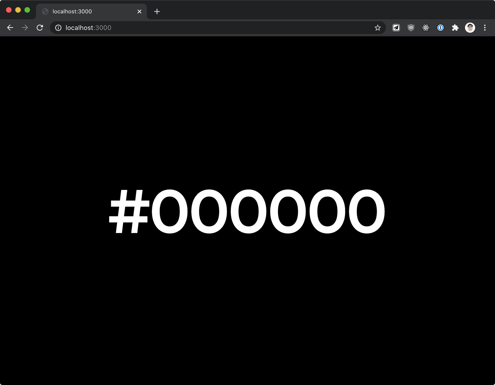
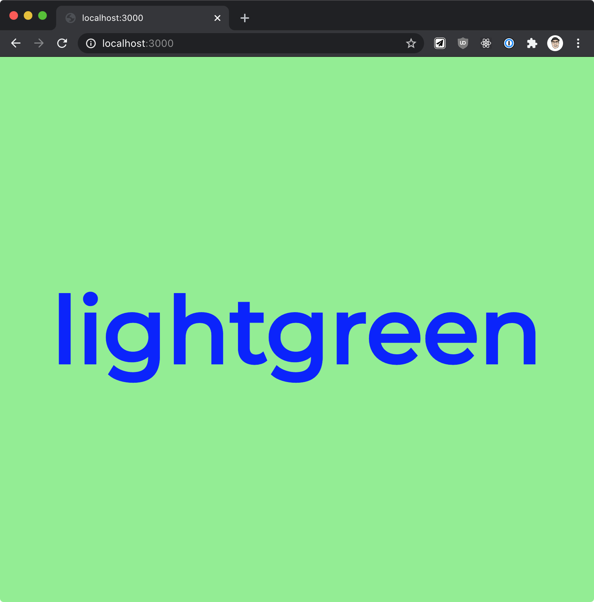
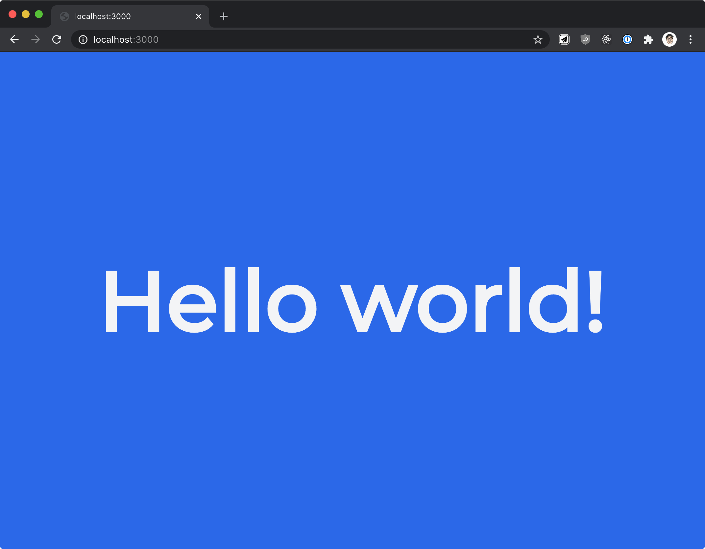

# Color App 🟥🟨🟩🟦

This app can be used in scenarios where you need multiple website instances that do nothing, but look different. This app displays a web page with a message in the center of the page. The colors (background and foreground) and the message are configurable through environment variables.

## Configuration

| Environment variable name | Description |
| --- | --- |
| `BG_COLOR` | Background color for the website (defaults to ⬛️) |
| `FG_COLOR` | Foreground (text) color (defaults to ⬜️) |
| `MESSAGE` | Message to be displayed (defaults to background color name, if not provided) |
| `VERSION` | App version, returned from `/version` endpoint (defaults to package version, if not provided) |

The colors can be provided as names (`red`, `green`) or as HEX values (`#FF0000`, `#00ff00`).

## Usage

| Command | Rendered Page |
| --- | --- |
| `node app.js` |  |
| `FG_COLOR=blue BG_COLOR=lightgreen node app.js` |  |
| `MESSAGE="Hello world!" FG_COLOR="#f3f4f6" BG_COLOR="#2563eb" node app.js` |  |

### Using Docker image

You can also run the application as a Docker container. You can pull the image from `pj3677/color-app:1.0.0`.

Example usage:

```
docker run --env FG_COLOR="blue" -p 3000:3000 pj3677/color-app:1.0.0
```